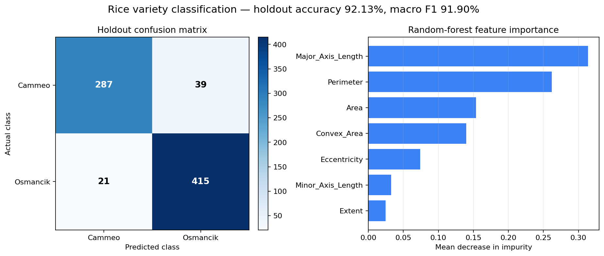

# Pirinç Türü Sınıflandırma

[English README](README.md)

Yedi morfolojik ölçümü kullanarak **Cammeo** ve **Osmancik** pirinç türlerini
sınıflandıran, sonuçları yeniden üretilebilir bir makine öğrenmesi çalışmasıdır.

Çalışmada yalnızca yüksek görünen tek bir skora odaklanılmadı. Veri, sınıf
oranları korunarak ve sabit bir tohumla ayrıldı; beş katlı çapraz doğrulama
yalnızca eğitim bölümü üzerinde çalıştırıldı; son metrikler daha önce
görülmemiş %20'lik test bölümünden elde edildi.



## Sonuçlar

| Değerlendirme | Metrik | Sonuç |
|---|---|---:|
| Eğitim bölümü, 5 katlı çapraz doğrulama | Doğruluk | %92,45 ± %1,10 |
| Eğitim bölümü, 5 katlı çapraz doğrulama | Makro F1 | %92,29 ± %1,11 |
| Bağımsız test bölümü (762 satır) | Doğruluk | %92,13 |
| Bağımsız test bölümü (762 satır) | Makro F1 | %91,90 |

Satırlar gerçek sınıfı, sütunlar tahmini gösterecek şekilde bağımsız test
bölümünün karmaşıklık matrisi:

|  | Cammeo tahmini | Osmancik tahmini |
|---|---:|---:|
| Gerçek Cammeo | 287 | 39 |
| Gerçek Osmancik | 21 | 415 |

Bu sonuçlar eski bir not defteri çıktısından kopyalanmadı; `rice_model.py`
içindeki sabit deney düzeniyle yeniden üretildi. Ayrıntılı sonuçlar
[`docs/metrics.json`](docs/metrics.json) dosyasında bulunuyor.

## Yöntem

- **Veri:** 3.810 satır, yedi sayısal özellik, eksik veya yinelenen satır yok
- **Sınıflar:** 1.630 Cammeo ve 2.180 Osmancik örneği
- **Model:** 300 ağaçlı, `min_samples_leaf=2` ayarlı rastgele orman
- **Ayrım:** sınıf oranlarını koruyan %80/%20 ayrım, `random_state=42`
- **Doğrulama:** yalnızca eğitim bölümünde beş katlı tabakalı çapraz doğrulama
- **Metrikler:** doğruluk, dengeli doğruluk, makro kesinlik, makro duyarlılık ve
  makro F1

Rastgele orman modeli özellik ölçeklendirmesine ihtiyaç duymadığı için
ölçeklendirici kullanılmadı. Son değerlendirmeden önce hiçbir ön işleme adımı
test bölümünün etiketlerini veya ölçümlerini görmüyor.

## Çalıştırma

Python 3.10 veya daha yeni bir sürüm önerilir.

```bash
python -m venv .venv
source .venv/bin/activate
python -m pip install -r requirements.txt
python train.py
```

Komut, `artifacts/` altında `metrics.json` ve `evaluation-summary.png`
dosyalarını üretir. Kontrolleri çalıştırmak için:

```bash
python -m pip install -r requirements-dev.txt
python -m pytest
```

[`notebooks/rice_exploration.ipynb`](notebooks/rice_exploration.ipynb)
not defteri de komut satırıyla aynı test edilmiş işlevleri kullanır ve kayıtlı
çıktı içermez.

## Proje yapısı

```text
.
├── data/                         # Kaynak çalışma kitabı
├── docs/                         # Yeniden üretilmiş değerlendirme sonuçları
├── notebooks/                    # Çıktısız inceleme not defteri
├── tests/                        # Veri ve eğitim kontrolleri
├── rice_model.py                 # Yükleme, doğrulama, eğitim ve raporlama
└── train.py                      # Komut satırı giriş noktası
```

## Veri kaynağı ve kapsam

Çalışma kitabındaki satır ve değerler, UCI'ın resmi **Rice (Cammeo and
Osmancik)** veri kümesiyle birebir eşleşiyor:

- Ilkay Cinar ve Murat Koklu (2019)
- [UCI veri kümesi sayfası](https://archive.ics.uci.edu/dataset/545/rice+cammeo+and+osmancik)
- DOI: [10.24432/C5MW4Z](https://doi.org/10.24432/C5MW4Z)
- Veri kümesi lisansı: [CC BY 4.0](https://creativecommons.org/licenses/by/4.0/)

Bu proje, daha önce görüntülerden çıkarılmış tablo biçimindeki ölçümleri
sınıflandırır; ham pirinç görüntülerini sınıflandırmaz. Veri kümesi lisansı,
atıf verilmesi koşuluyla yeniden dağıtıma izin verir. Depodaki kaynak kod için
ayrı bir lisans henüz seçilmedi.
